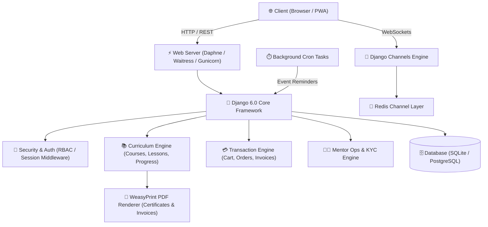

# 🎓 Mentor LMS — Learning Management System

[](https://www.djangoproject.com/)
[](https://www.python.org/)
[](https://channels.readthedocs.io/)
[](https://weasyprint.org/)
[](https://www.postgresql.org/)

**Mentor LMS** is an enterprise-grade, high-performance Learning Management System built with Django 6.0 and Python 3.14. Designed for scale, it integrates real-time WebSocket notifications, dynamic PDF certificate & invoice rendering, multi-tiered instructor operations, interactive progress tracking, and secure transaction workflows.

---

## 🏗️ System Architecture



---

## ✨ Enterprise Features

### 🔐 1. Identity & Security Architecture
* **Dual-Tier Authentication System**:
  * **Standard User Node**: Accessible via web authentication (`/identity/login/`).
  * **Superuser Security Protocol**: Admin accounts (`is_superuser=True`) are isolated from the web login page and restricted strictly to the secure Admin Command Center (`/admin/`).
* **Active Session Middleware**: Real-time session monitoring and multi-device session invalidation.
* **Role-Based Access Control (RBAC)**: Fine-grained permissions for Students, Instructors, and System Administrators.

### 📚 2. Curriculum & Learning Engine
* **Course Catalog & Lesson Hierarchy**: Structured courses with video support, rich descriptions, and lesson order management.
* **Interactive Progress Telemetry**: Real-time progress percentage calculation per enrolled student based on completed lesson tracking.
* **Dynamic PDF Certificate Generation**: Instant PDF generation powered by WeasyPrint with unique verification identifiers.
* **Certificate Verification Engine**: Public validation endpoint (`/verify/cert/<cert_id>/`) for third-party certificate authenticity checks.

### 💳 3. E-Commerce & Transaction Pipeline
* **Shopping Cart & Direct Checkout**: Full-featured cart management (`add_to_cart`, `remove_from_cart`) and streamlined checkout workflows.
* **Automated Invoice Generation**: On-the-fly PDF invoice generation (`/invoice/download/<order_id>/`) for completed purchases.
* **Multi-Currency Transaction Support**: Configurable currency models with order status tracking (`PENDING`, `PAID`, `FAILED`, `REFUNDED`).

### 👨‍🏫 4. Mentor Operations & KYC Verification
* **Instructor Onboarding Workflow**: Application form for prospective instructors with document verification.
* **KYC Document Compliance**: Upload and administrative audit pipeline for instructor KYC documents (`KYCDocument`).
* **Instructor Analytics & Reviews**: Interactive analytics charts and student review submission handshakes.

### 📡 5. Real-Time Signals & Event Cluster
* **WebSocket Signal Broadcasts**: Asynchronous real-time notification dispatch powered by **Django Channels** and Redis.
* **Event Management Cluster**: Live events, seat reservations, and instant `.ics` calendar file exports (`event_ics`).
* **Scheduled Background Reminders**: Automated event reminder dispatches running via `django-cron` background tasks.

---

## 📂 Project Structure

```
Mentor/
├── env/                            # Python Virtual Environment (Python 3.14)
└── Mentor/                         # Django Application Root
    ├── manage.py                   # Django CLI utility (Includes GLib warning suppression)
    ├── db.sqlite3                  # SQLite Database Instance
    ├── requirements.txt            # Python Dependencies
    ├── classapp/                   # Core Application Module
    │   ├── models.py               # Data Models (Courses, Lessons, Orders, KYC, etc.)
    │   ├── views.py                # Business Logic & Controllers (2600+ lines)
    │   ├── urls.py                 # Route Endpoints & API Handshakes
    │   ├── forms.py                # Form Validation Protocols
    │   ├── consumers.py            # WebSocket Channels Consumers
    │   ├── middleware.py           # Custom Active Session Middleware
    │   ├── admin_dashboard_views.py # Analytics & Command Center Views
    │   ├── templates/              # HTML5 Dynamic Templates
    │   └── static/                 # Static Assets (CSS, JS, Fonts, Images)
    └── it/                         # Project Configuration Module
        ├── __init__.py             # C-level stderr warning suppression
        ├── settings.py             # Global Django Settings
        ├── urls.py                 # Root URL Router
        ├── asgi.py                 # ASGI Config (Django Channels & WebSockets)
        └── wsgi.py                 # WSGI Config (Production HTTP Serving)
```

---

## 🛠️ Technology Stack

| Domain | Technology | Description |
| :--- | :--- | :--- |
| **Backend Framework** | **Django 6.0** | Enterprise Web Architecture |
| **Language** | **Python 3.14** | Modern Python Runtime |
| **WebSockets** | **Django Channels 4.3** | Real-time Asynchronous Telemetry |
| **PDF Processing** | **WeasyPrint 67.0 / ReportLab 4.4** | Server-side PDF Certificate & Invoice Generation |
| **Database** | **SQLite 3 / PostgreSQL** | Relational Data Storage |
| **Production Server** | **Daphne (ASGI) / Waitress (WSGI)** | Production-ready HTTP & WebSocket Serving |
| **Frontend Utilities** | **Bootstrap 5, AOS, Swiper** | Responsive UI Design |

---

## 🚀 Quick Start & Installation

### 1. Prerequisites
Ensure you have **Python 3.14+** installed.

### 2. Environment Setup
Clone the repository and enter the project directory:
```bash
git clone https://github.com/PlatonicM/Mentor.git
cd Mentor/Mentor
```

Activate the virtual environment:
```powershell
# Windows PowerShell
..\env\Scripts\activate
```
*(If PowerShell blocks script execution, run: `Set-ExecutionPolicy -ExecutionPolicy RemoteSigned -Scope Process`)*

### 3. Database Migration
Apply database migrations:
```bash
..\env\Scripts\python.exe manage.py migrate
```

### 4. Create Superuser (Admin)
```bash
..\env\Scripts\python.exe manage.py createsuperuser
```

### 5. Launch Server

#### 🔹 Development Server:
```bash
..\env\Scripts\python.exe manage.py runserver
```

#### 🔹 Production Server (Recommended - Daphne ASGI):
```bash
..\env\Scripts\daphne.exe -b 127.0.0.1 -p 8000 it.asgi:application
```

#### 🔹 Production Server (Waitress WSGI):
```bash
..\env\Scripts\waitress-serve.exe --port=8000 it.wsgi:application
```

---

## 🔑 Default Credentials & Access Endpoints

| Portal | Endpoint | Allowed Roles | Default Admin Credentials |
| :--- | :--- | :--- | :--- |
| **Admin Command Center** | [`/admin/`](http://127.0.0.1:8000/admin/) | Superusers Only | **User:** `mentor`<br>**Pass:** `Pass@123` |
| **Learner Web Interface** | [`/identity/login/`](http://127.0.0.1:8000/identity/login/) | Students & Instructors | **User:** `rutika`<br>**Pass:** `Pass@123` |
| **Public Homepage** | [`/`](http://127.0.0.1:8000/) | Public | N/A |
| **Certificate Verification** | [`/verify/cert/<id>/`](http://127.0.0.1:8000/verify/cert/1/) | Public Validation | N/A |

---

## 🔒 Security Best Practices

1. **Superuser Isolation**: Standard website login forms (`/identity/login/`) reject superuser credentials to enforce administrative access strictly through administrative multi-factor channels.
2. **Environment Variables**: Configure sensitive keys (`SECRET_KEY`, `EMAIL_HOST_PASSWORD`, database credentials) using `.env` files via `python-dotenv`.
3. **C-Level Warning Redirection**: Built-in GLib/GIO low-level C-stderr redirection in `it/__init__.py` prevents Windows UWP shell probing warnings from polluting server output.

---

## 📜 License & Governance

Licensed under the [MIT License](LICENSE). Built for enterprise learning environments.
