# 🎓Mentor — Next-Gen Learning Platform

[](https://www.djangoproject.com/)
[](https://www.python.org/)
[](https://www.mongodb.com/)
[](https://channels.readthedocs.io/)
[](https://weasyprint.org/)
[](#-security--authorization-matrix)

---

## 📌 Table of Contents
1. [Overview](#-overview)
2. [Platform Screenshots](#-platform-screenshots)
3. [System Architecture Topology](#-system-architecture-topology)
4. [Algorithm Flowchart](#-algorithm-flowchart)
5. [SDLC (Software Development Life Cycle)](#-sdlc-software-development-life-cycle)
6. [Component Sequence Flowchart](#-component-sequence-flowchart)
7. [Entity-Relationship (ER) Schema](#-entity-relationship-er-schema)
8. [Database Architecture & Hybrid Storage](#-database-architecture--hybrid-storage)
9. [Class Diagram & Domain Entities](#-class-diagram--domain-entities)
10. [Admin Command Center Flowchart](#-admin-command-center-flowchart)
11. [Student & Learner Lifecycle Sequence](#-student--learner-lifecycle-sequence)
12. [Certificate Verification Topology](#-certificate-verification-topology)
13. [Key Features & System Capabilities](#-key-features--system-capabilities)
14. [Installation & Operational Setup](#-installation--operational-setup)
15. [Security & Authorization Matrix](#-security--authorization-matrix)
16. [About The Author](#-about-the-author)
17. [License](#-license)

---

## 🚀 Overview

**Mentor** is an enterprise-grade high-performance Learning Management & Executive Education Ecosystem built on **Django 6.0**, **Python 3.14**, **ReportLab Vector Graphics**, and a hybrid **SQLite + MongoDB** persistence engine. 

Designed with modern slate and indigo aesthetic design systems, Mentor delivers 1-on-1 mentorship, dynamic course video delivery, automated OTP authentication, cryptographic certificate generation, live sales analytics, and automated multi-channel notifications.

---

## 🖼️ Platform Screenshots

| Page View | Interface Preview |
| :--- | :--- |
| **🏠 Hero Section** | 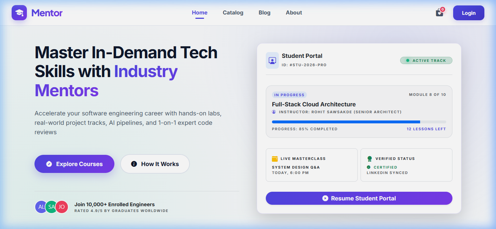 |
| **📚 Courses Catalog** | 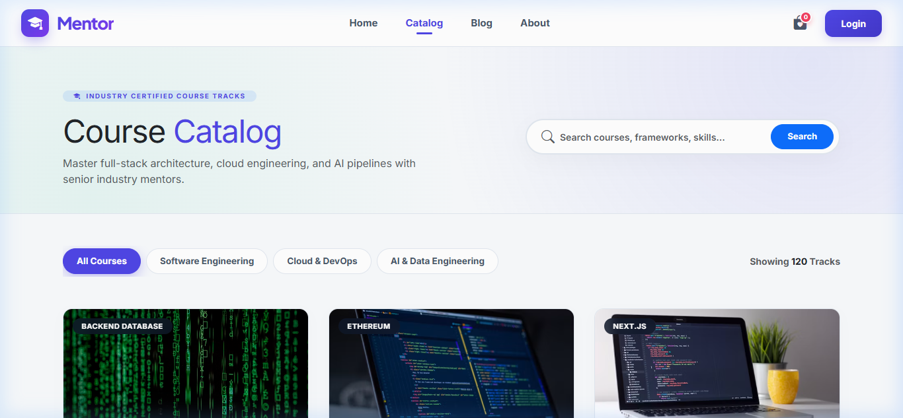 |
| **📰 Blog & Articles** | 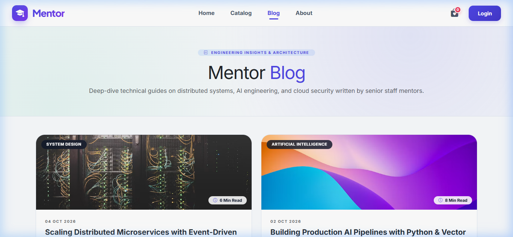 |
| **ℹ️ About Mentor** | 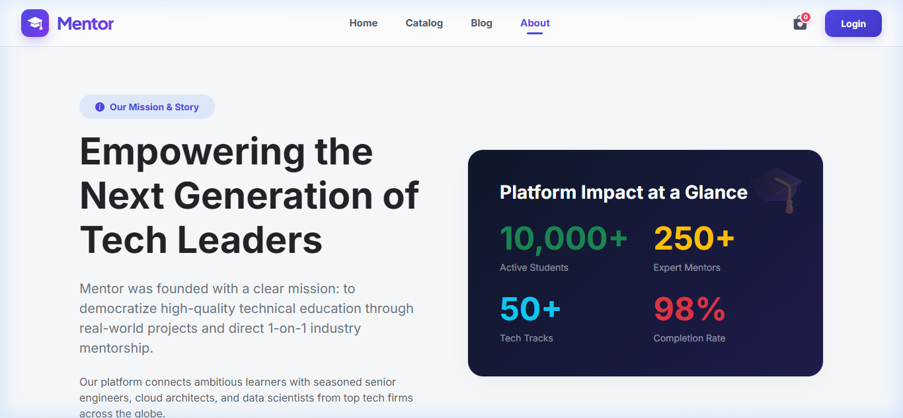 |
| **🔑 Secure Login** | 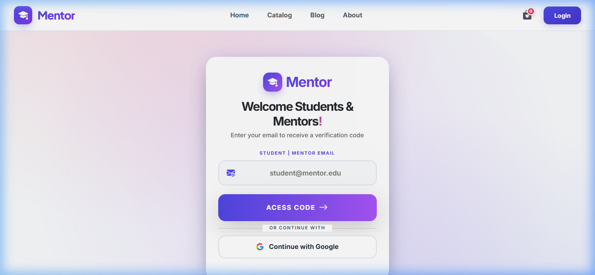 |
| **📊 Student Dashboard** | 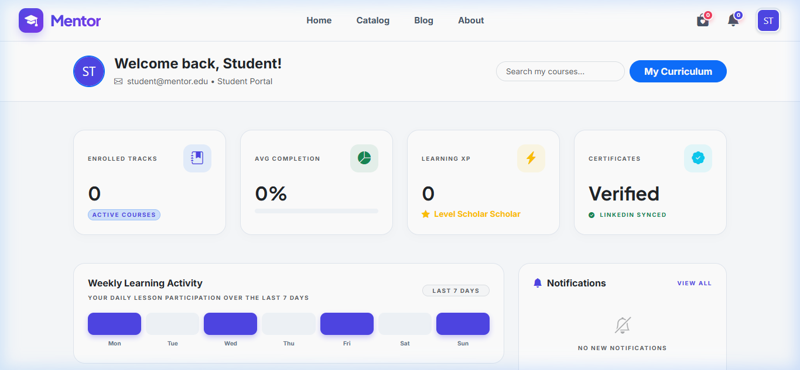 |
| **🚀 Learning Hub** | 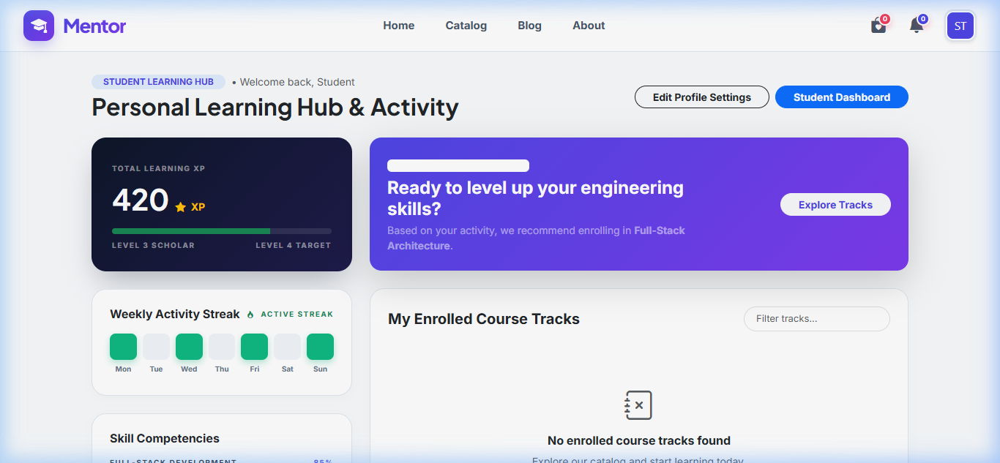 |

---

## 🏗️ System Architecture Topology

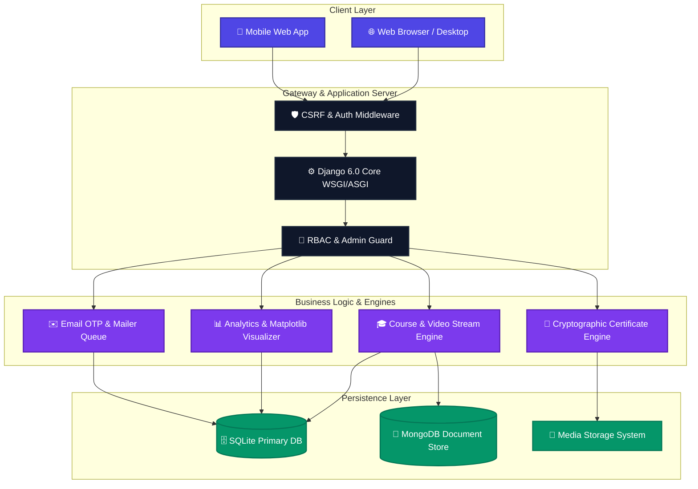
```mermaid
graph TD
    subgraph Client_Layer["Client Layer"]
        A["🌐 Web Browser / Desktop"]
        B["📱 Mobile Web App"]
    end

    subgraph Gateway_App["Gateway & Application Server"]
        C["🛡️ CSRF & Auth Middleware"]
        D["⚙️ Django 6.0 Core WSGI/ASGI"]
        E["🔑 RBAC & Admin Guard"]
    end

    subgraph Business_Logic["Business Logic & Engines"]
        F["🎓 Course & Video Stream Engine"]
        G["📜 Cryptographic Certificate Engine"]
        H["📊 Analytics & Matplotlib Visualizer"]
        I["✉️ Email OTP & Mailer Queue"]
    end

    subgraph Persistence["Persistence Layer"]
        J[("🗄️ SQLite Primary DB")]
        K[("🍃 MongoDB Document Store")]
        L["📁 Media Storage System"]
    end

    A --> C
    B --> C
    C --> D
    D --> E
    E --> F
    E --> G
    E --> H
    E --> I
    F --> J
    F --> K
    G --> L
    H --> J
    I --> J

    classDef client fill:#4f46e5,color:#fff,stroke:#3730a3,stroke-width:2px;
    classDef app fill:#0f172a,color:#fff,stroke:#1e293b,stroke-width:2px;
    classDef db fill:#059669,color:#fff,stroke:#047857,stroke-width:2px;
    classDef bg fill:#7c3aed,color:#fff,stroke:#5b21b6,stroke-width:2px;

    class A,B client;
    class C,D,E app;
    class F,G,H,I bg;
    class J,K,L db;
```

---

## ⚡ Algorithm Flowchart


```mermaid
flowchart TD
    subgraph OTP_Engine["1. OTP Authentication & Verification Algorithm"]
        A1[User Requests Login] --> A2{User Credentials Valid?}
        A2 -- No --> A3[Return 401 Unauthorized Error]
        A2 -- Yes --> A4[Generate Cryptographic 6-Digit Token]
        A4 --> A5[Store Hashed OTP in DB with 10-Min Expiry]
        A5 --> A6[Dispatch Async SMTP Email to User]
        A6 --> A7[User Submits Input Code]
        A7 --> A8{Is Code Valid & Unexpired?}
        A8 -- Valid --> A9[Mark OTP Used & Issue Auth Cookie]
        A8 -- Invalid --> A10[Increment Failure Counter & Block Access]
    end

    subgraph Pricing_Engine["2. Dynamic Course Pricing Algorithm"]
        B1[Fetch Course Record from MongoDB/SQLite] --> B2{User Has Active Coupon?}
        B2 -- Yes --> B3["Apply Discount Token"]
        B2 -- No --> B4{Course In Flash Sale?}
        B4 -- Yes --> B5["Apply Seasonal Discount Rate"]
        B4 -- No --> B6[Set Standard Catalog Price]
        B3 --> B7[Compute Final Cart Total & Invoice Tax]
        B5 --> B7
        B6 --> B7
    end

    subgraph Cert_Engine["3. Vector Certificate & QR Signing Algorithm"]
        C1[Student Completes Track Modules] --> C2[Generate Cryptographic Code]
        C2 --> C3["Create Public Verification Path"]
        C3 --> C4[Generate High-Resolution Vector QR Code Payload]
        C4 --> C5[Initialize ReportLab PDF Canvas Stream]
        C5 --> C6[Draw Custom Typography, Badges & Embedded QR Code]
        C6 --> C7[Compile High-Res Vector PDF File & Store in Media]
    end
```

---

## 🔄 SDLC (Software Development Life Cycle)

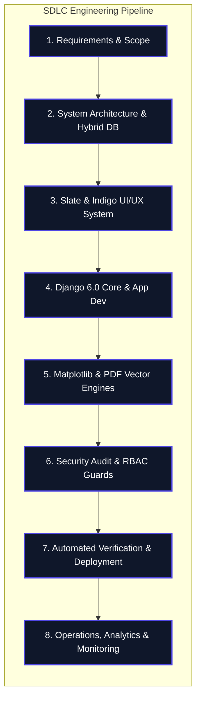
```mermaid
graph LR
    subgraph SDLC_Pipeline["SDLC Engineering Pipeline"]
        Phase1["1. Requirements & Scope"] --> Phase2["2. System Architecture & Hybrid DB"]
        Phase2 --> Phase3["3. Slate & Indigo UI/UX System"]
        Phase3 --> Phase4["4. Django 6.0 Core & App Dev"]
        Phase4 --> Phase5["5. Matplotlib & PDF Vector Engines"]
        Phase5 --> Phase6["6. Security Audit & RBAC Guards"]
        Phase6 --> Phase7["7. Automated Verification & Deployment"]
        Phase7 --> Phase8["8. Operations, Analytics & Monitoring"]
    end

    classDef phase fill:#0f172a,color:#fff,stroke:#4f46e5,stroke-width:2px;
    class Phase1,Phase2,Phase3,Phase4,Phase5,Phase6,Phase7,Phase8 phase;
```

---

## 🔄 Component Sequence Flowchart

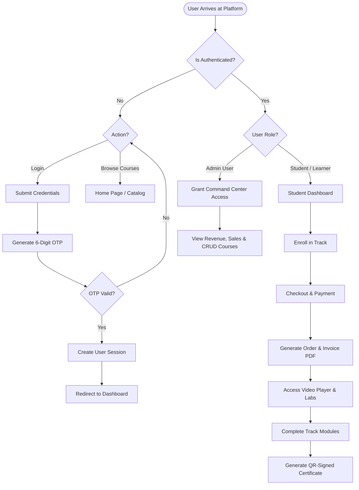
```mermaid
flowchart TD
    Start([User Arrives at Platform]) --> CheckAuth{Is Authenticated?}
    
    CheckAuth -- No --> AuthChoice{Action?}
    AuthChoice -- Login --> LoginProcess[Submit Credentials] --> OTPGen[Generate 6-Digit OTP] --> VerifyOTP{OTP Valid?}
    VerifyOTP -- Yes --> GrantSession[Create User Session] --> DashboardRedirect[Redirect to Dashboard]
    VerifyOTP -- No --> AuthChoice
    
    AuthChoice -- Browse Courses --> ViewHome[Home Page / Catalog]
    
    CheckAuth -- Yes --> RoleCheck{User Role?}
    
    RoleCheck -- "Admin User" --> AdminGate["Grant Command Center Access"] --> AdminDashboard["View Revenue, Sales & CRUD Courses"]
    RoleCheck -- "Student / Learner" --> StudentDash[Student Dashboard]
    
    StudentDash --> Enroll[Enroll in Track] --> Checkout["Checkout & Payment"] --> OrderPaid["Generate Order & Invoice PDF"]
    OrderPaid --> StreamCourse[Access Video Player & Labs]
    StreamCourse --> PassExam[Complete Track Modules] --> IssueCert[Generate QR-Signed Certificate]
```

---

## 📐 Entity-Relationship (ER) Schema

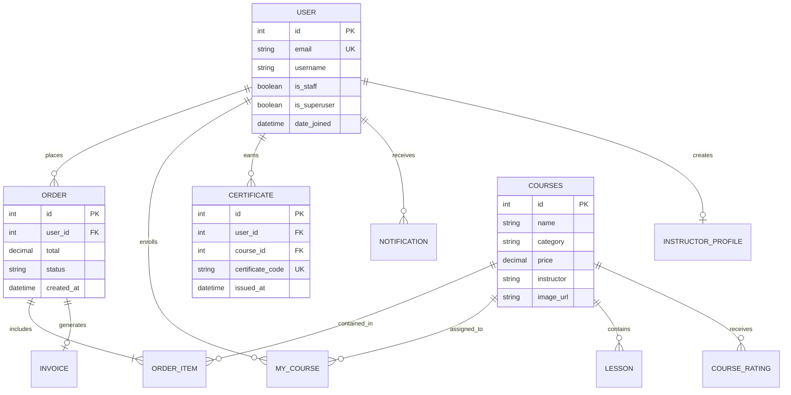
```mermaid
erDiagram
    USER ||--o{ ORDER : places
    USER ||--o{ MY_COURSE : enrolls
    USER ||--o{ CERTIFICATE : earns
    USER ||--o{ NOTIFICATION : receives
    USER ||--o| INSTRUCTOR_PROFILE : creates

    COURSES ||--o{ ORDER_ITEM : contained_in
    COURSES ||--o{ MY_COURSE : assigned_to
    COURSES ||--o{ LESSON : contains
    COURSES ||--o{ COURSE_RATING : receives

    ORDER ||--|{ ORDER_ITEM : includes
    ORDER ||--o| INVOICE : generates

    USER {
        int id PK
        string email UK
        string username
        boolean is_staff
        boolean is_superuser
        datetime date_joined
    }

    COURSES {
        int id PK
        string name
        string category
        decimal price
        string instructor
        string image_url
    }

    ORDER {
        int id PK
        int user_id FK
        decimal total
        string status
        datetime created_at
    }

    CERTIFICATE {
        int id PK
        int user_id FK
        int course_id FK
        string certificate_code UK
        datetime issued_at
    }
```

---

## 💾 Database Architecture & Hybrid Storage

Mentor utilizes a **Hybrid Multi-Database Architecture** to optimize relational integrity alongside high-throughput document persistence:

| Data Store | Purpose | Components Managed | Storage Path |
| :--- | :--- | :--- | :--- |
| **Relational (SQLite / PostgreSQL)** | Core ACID Transactions | Users, Auth, Orders, Invoices, Certificates, Ratings | `db.sqlite3` |
| **Document (MongoDB)** | High-Volume Course Collections & System Logs | Course Management, Extended Analytics | `mongodb_data/` |
| **File Engine** | Vector PDFs & Assets | QR Verification Badges, Generated Invoices | `media/` & `staticfiles_build/` |

---

## 🧩 Class Diagram & Domain Entities

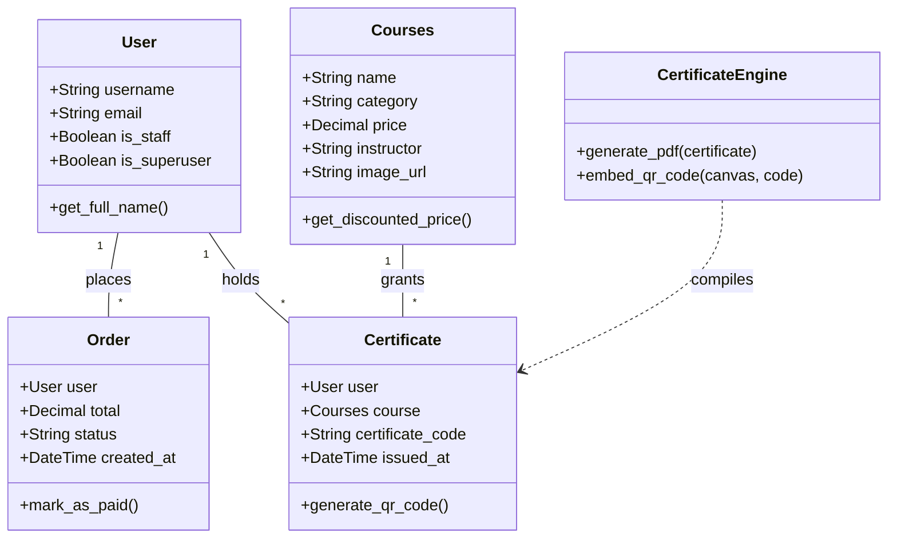
```mermaid
classDiagram
    class User {
        +String username
        +String email
        +Boolean is_staff
        +Boolean is_superuser
        +get_full_name()
    }

    class Courses {
        +String name
        +String category
        +Decimal price
        +String instructor
        +String image_url
        +get_discounted_price()
    }

    class Order {
        +User user
        +Decimal total
        +String status
        +DateTime created_at
        +mark_as_paid()
    }

    class Certificate {
        +User user
        +Courses course
        +String certificate_code
        +DateTime issued_at
        +generate_qr_code()
    }

    class CertificateEngine {
        +generate_pdf(certificate)
        +embed_qr_code(canvas, code)
    }

    User "1" -- "*" Order : places
    User "1" -- "*" Certificate : holds
    Courses "1" -- "*" Certificate : grants
    CertificateEngine ..> Certificate : compiles
```

---

## 🛠️ Admin Command Center Flowchart

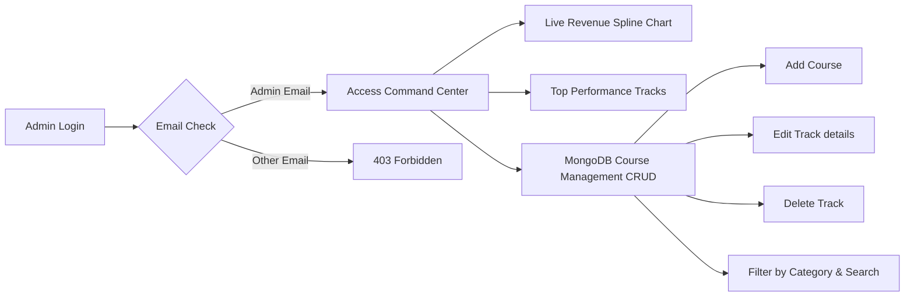
```mermaid
graph LR
    A[Admin Login] --> B{Email Check}
    B -- "Admin Email" --> C["Access Command Center"]
    B -- "Other Email" --> D[403 Forbidden]
    
    C --> E[Live Revenue Spline Chart]
    C --> F[Top Performance Tracks]
    C --> G[MongoDB Course Management CRUD]
    
    G --> H[Add Course]
    G --> I[Edit Track details]
    G --> J[Delete Track]
    G --> K[Filter by Category & Search]
```

---

## 👤 Student & Learner Lifecycle Sequence

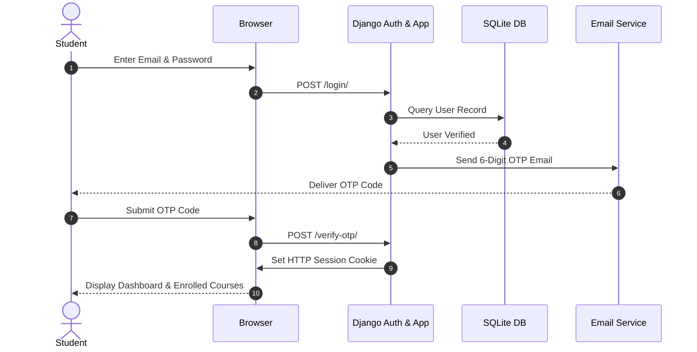
```mermaid
sequenceDiagram
    autonumber
    actor Student
    participant Browser
    participant Django as Django Auth & App
    participant DB as SQLite DB
    participant Mail as Email Service

    Student->>Browser: Enter Email & Password
    Browser->>Django: POST /login/
    Django->>DB: Query User Record
    DB-->>Django: User Verified
    Django->>Mail: Send 6-Digit OTP Email
    Mail-->>Student: Deliver OTP Code
    Student->>Browser: Submit OTP Code
    Browser->>Django: POST /verify-otp/
    Django->>Browser: Set HTTP Session Cookie
    Browser-->>Student: Display Dashboard & Enrolled Courses
```

---

## 📜 Certificate Verification Topology

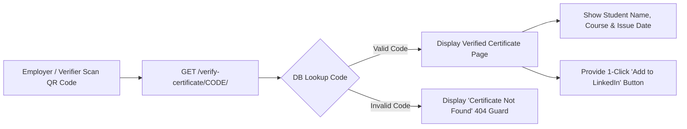
```mermaid
flowchart LR
    A["Employer / Verifier Scan QR Code"] --> B["GET /verify-certificate/CODE/"]
    B --> C{DB Lookup Code}
    C -- "Valid Code" --> D[Display Verified Certificate Page]
    D --> E[Show Student Name, Course & Issue Date]
    D --> F["Provide 1-Click 'Add to LinkedIn' Button"]
    C -- "Invalid Code" --> G["Display 'Certificate Not Found' 404 Guard"]
```

---

## ✨ Key Features & System Capabilities

- **🔐 Strict Access Security**: Command Center access (`/command-center/dashboard/`) restricted to administrator accounts and system superusers with built-in 403 authorization guards.
- **📊 Real-time Operational Analytics**: Figma-inspired Spline Bar Charts powered by Matplotlib for monthly earnings and top performing course tracks.
- **📜 Vector Certificate Generator**: Custom ReportLab PDF compilation with cryptographic QR verification codes and 1-click LinkedIn profile integration.
- **🛒 Complete E-Commerce Engine**: Interactive shopping cart, instant checkout, auto-generated PDF invoices, and payment tracking.
- **🎨 Modern Slate & Indigo Aesthetic**: Clean `#ffffff` light-mode Django admin styling, responsive navigation, and mobile-first container layouts.

---

## 📦 Installation & Operational Setup

### 1. Clone & Prepare Environment
```bash
git clone https://github.com/PlatonicM/Mnetor.git
cd Mentor/Mentor
python -m venv env
source env/bin/activate  # On Windows: env\Scripts\activate
```

### 2. Install Dependencies
```bash
pip install -r requirements.txt
```

### 3. Database Migrations & Superuser
```bash
python manage.py migrate
python manage.py createsuperuser
```

### 4. Run Server
```bash
python manage.py runserver
```
Navigate to `http://127.0.0.1:8000/` in your web browser.

---

## 🛡️ Security & Authorization Matrix

| User Role | Access Level | Granted Paths |
| :--- | :--- | :--- |
| **Super Admin** | Full Control | `/admin/`, `/command-center/dashboard/`, `/command-center/sales-chart/` |
| **Instructor** | Course Management | `/instructor/dashboard/`, `/instructor/create-event/` |
| **Enrolled Student** | Learning Portal | `/dashboard/`, `/my-courses/`, `/course-player/`, `/verify-certificate/` |
| **Anonymous Visitor** | Public Access | `/`, `/courses/`, `/about/`, `/contact/`, `/pricing/` |

---

## 👨‍💻 About The Author

<div align="center">
  <h3><strong>Mrunal Chaudhari</strong></h3>
  <p><em>Full-Stack Software Engineer & Distributed Systems Architect</em></p>

  <a href="https://www.linkedin.com/in/mrunal-chaudhari03/"></a>
  <a href="https://github.com/PlatonicM"></a>
</div>

<br/>

**Mrunal Chaudhari** is a passionate Full-Stack Engineer specializing in Python/Django web ecosystems, cloud native infrastructure, microservices, and database architecture. He builds high-availability platforms, interactive learning management systems, and automated cloud workflows.

---

## 📄 License

This project is open-source software licensed under the **[MIT License](LICENSE)**.

```text
MIT License

Copyright (c) 2026 Mrunal Chaudhari (PlatonicM)

Permission is hereby granted, free of charge, to any person obtaining a copy
of this software and associated documentation files (the "Software"), to deal
in the Software without restriction, including without limitation the rights
to use, copy, modify, merge, publish, distribute, sublicense, and/or sell
copies of the Software, and to permit persons to whom the Software is
furnished to do so, subject to the following conditions:

The above copyright notice and this permission notice shall be included in all
copies or substantial portions of the Software.

THE SOFTWARE IS PROVIDED "AS IS", WITHOUT WARRANTY OF ANY KIND, EXPRESS OR
IMPLIED, INCLUDING BUT NOT LIMITED TO THE WARRANTIES OF MERCHANTABILITY,
FITNESS FOR A PARTICULAR PURPOSE AND NONINFRINGEMENT. IN NO EVENT SHALL THE
AUTHORS OR COPYRIGHT HOLDERS BE LIABLE FOR ANY CLAIM, DAMAGES OR OTHER
LIABILITY, WHETHER IN AN ACTION OF CONTRACT, TORT OR OTHERWISE, ARISING FROM,
OUT OF OR IN CONNECTION WITH THE SOFTWARE OR THE USE OR OTHER DEALINGS IN THE
SOFTWARE.
```

---

<p align="center">
  Made by <strong>Mrunal Chaudhari❤️</strong> (<a href="https://github.com/PlatonicM">@PlatonicM</a>)
</p>
